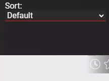
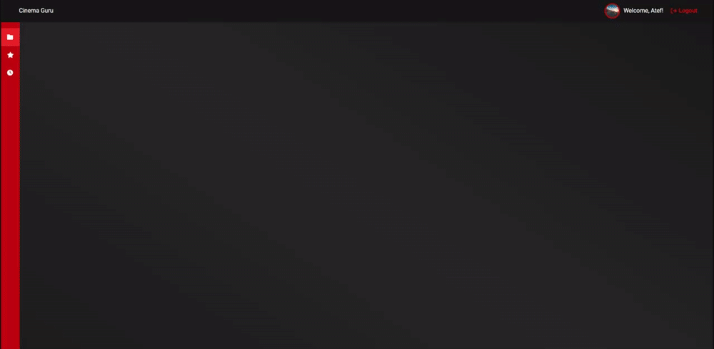

# 0x0B. Implement an app with React

<p align="center">

</p>

Hello everyone, in this project I will build a pocket movie app in which we will keep track of our favorite movies and set up a watch later list. I will use the ReactJs knowledge that I accumulated in previous projects to build the interface and show data from an API.

## Learning Objectives 🎯

- Manage state and props in a react component
- Use React hooks to achieve certain behavior
- Implement a design with JSX and CSS (React)
- Implement a frontend app with React

## Requirements 📝

- Class components are not allowed
- A README.md file, at the root of the folder of the project, is mandatory
- Try to use ES6 features

## Api: [Documentation](./routes/README.md)

## Steps 🪜

### **0: Cloning the [Figma](https://intranet.hbtn.io/rltoken/y6fbJw-Sx3qLJdU1jYbuVw) project**

<p align="center">

</p>

### **1: Setting up the workspace**

### **2: Adding the general use components**

<p align="center">

</p>

<p align="center">

</p>

<p align="center">

</p>

<p align="center">

</p>

<p align="center">

</p>

### **3: Initialize the main App component**

### **4: Authentication - Component behavior**

<p align="center">

</p>

<p align="center">

</p>

<p align="center">

</p>

<p align="center">

</p>

### **5: Authentication: Api integration**

### **6: Navigation - Adding the header**

<p align="center">

</p>

<p align="center">

</p>

### **7: Navigation - Sidebar**

<p align="center">

</p>

<p align="center">

</p>

<p align="center">

</p>

### **8: Dashboard routing**

### **9: Dashboard - Setting up child components**

<p align="center">

</p>

<p align="center">

</p>

<p align="center">

</p>

### **10: DAshboard - Main pages**

<p align="center">

</p>

<p align="center">

</p>

<p align="center">

</p>

## Challenges 💪

- Create an interface according to customer request.
- Use all accumulated React knowledges.
- Work with a new Api.

## Tools 🛠️

| React | React Developer Tools | Axios |
|:---:|:---:|:---:|
|  |  |  |

## Cloning the repo ➡️

To clone this repository, you can run this command:
```
git clone git@github.com:rmarcais/holbertonschool-cinema-guru.git
```

## Author 🖊️

| Rémi Marçais (Portfolio projetct [here](https://github.com/rmarcais/Portfolio_project_Motiv)) |
|:---:|
| <a href="https://www.linkedin.com/in/r%C3%A9mi-mar%C3%A7ais-274a4421a/">  <a href="https://github.com/rmarcais">  |